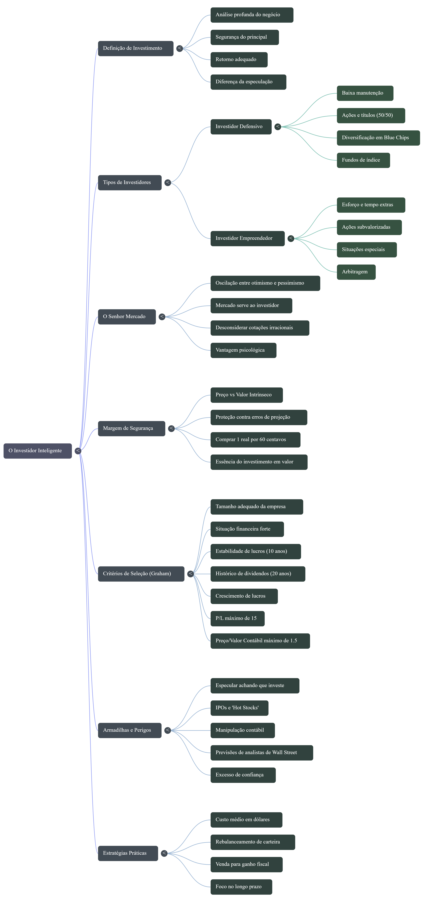

# Notebook LM – O Investidor Inteligente

Este repositório faz parte de uma atividade acadêmica desenvolvida com o uso do Notebook LM.  
O projeto explora os principais conceitos do livro **O Investidor Inteligente**, de Benjamin Graham, com foco em investimento em valor e segurança.

---

## 📘 Obra Base

**Título:** O Investidor Inteligente  
**Autor:** Benjamin Graham  

A obra estabelece os fundamentos do investimento em valor, destacando a diferença entre investir e especular, a importância do valor intrínseco e o controle emocional nas decisões financeiras.

---

## 🎯 Objetivo do Projeto

Organizar e sintetizar os conceitos centrais da obra a partir de múltiplas fontes, transformando o conteúdo em diferentes formatos:

- Mapa mental  
- Infográfico  
- Resumo em áudio  
- Resumo em vídeo  

O foco é compreender os fundamentos do investimento em valor e sua aplicação prática.

---

## 🧠 Conceitos Principais

- Diferença entre investimento e especulação  
- Valor intrínseco  
- Margem de segurança  
- Sr. Mercado  
- Diversificação  
- Disciplina emocional  
- Visão de longo prazo  

A principal mensagem do livro é que o sucesso do investidor depende mais de comportamento e disciplina do que da tentativa de prever o mercado.

---

## 🗺️ Mapa Mental

---

## 📊 Infográfico

---

## 🎧 Resumo em Áudio

▶️ [Ouvir resumo em áudio](resumo_investidor_inteligente.mp3)

Formato: MP3 | Compressão otimizada para voz

---

## 🎥 Resumo em Vídeo

▶️ [Assistir resumo em vídeo](resumo_investidor_inteligente.mp4)

---

## 📚 Observação

Este projeto possui finalidade exclusivamente educacional e não constitui recomendação de investimento.
